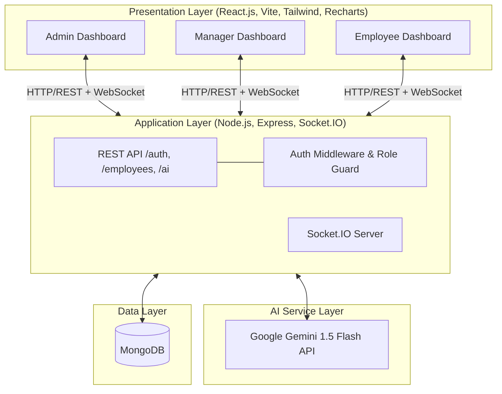
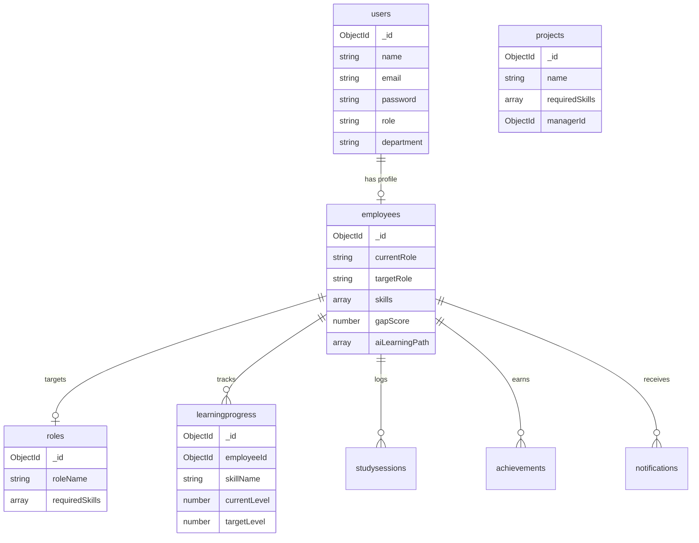
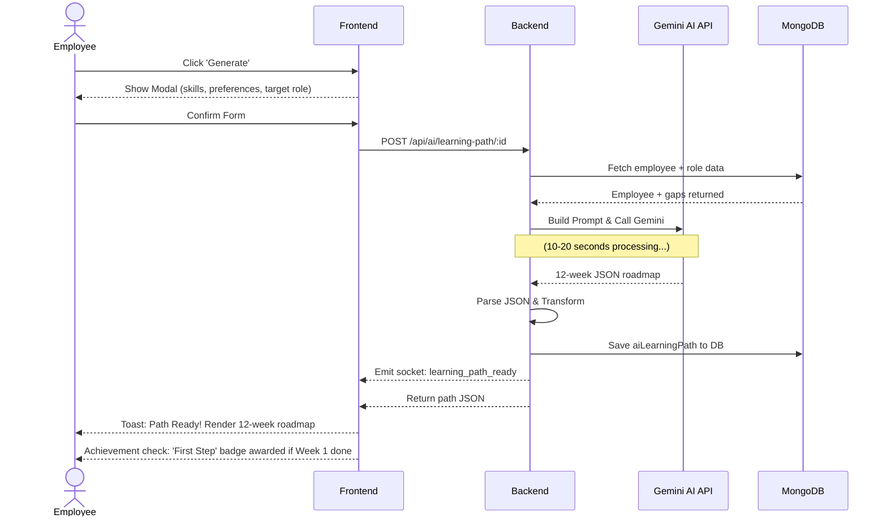

# SkillGap Platform
*AI-Powered Skill Gap Analysis & Personalized Learning Platform*

**Product Design & Technical Report**
Prepared By: **Megharaj Dandgavhal**
Date: March 2026

---

## Abstract
Organizations invest heavily in employee training, yet much of it remains ineffective due to misalignment with individual career goals or business requirements. Managers often discover skill gaps only when it is too late — mid-project or during performance reviews. This creates a critical need for a smart, data-driven platform that proactively identifies skill gaps and provides actionable learning paths.

This report presents the design and development of the **SkillGap Platform** — an AI-Powered Skill Gap Analysis and Personalized Learning System. The platform analyzes employee profiles including their skills, project history, and current role, identifies gaps relative to a target role or project requirement, and generates personalized learning paths to bridge those gaps.

The platform leverages Google Gemini AI for intelligent analysis and recommendation generation, Socket.IO for real-time updates, MongoDB for data persistence, and React.js for a responsive user interface. It provides three distinct role-based dashboards for Admins, Managers, and Employees, each with features tailored to their specific needs. The system also provides a team-level view for managers showing collective skill coverage and critical gaps.

Key capabilities include AI-generated 12-week learning roadmaps with real YouTube video links and free course resources, real-time team notifications via Socket.IO, achievement and gamification systems, project skill mapping, and comprehensive analytics and reporting features.

---

## 1. Introduction
The modern workplace demands continuous skill development and alignment between employee capabilities and organizational needs. Human capital management has evolved significantly with the emergence of digital learning platforms, talent management systems, and AI-powered tools. However, most existing solutions remain reactive — identifying skill gaps only during annual reviews or after project failures.

In today's fast-evolving technology landscape, skills become outdated quickly. A developer proficient in React today may need Node.js, Docker, and cloud skills tomorrow. Organizations that lack a systematic approach to skill gap identification and remediation face increased project risks, higher employee turnover, and reduced competitiveness.

The **SkillGap Platform** addresses these challenges by providing a proactive, AI-driven system that continuously monitors employee skill profiles, compares them against role requirements, identifies gaps in real time, and generates personalized, actionable learning paths. The platform behaves like a career GPS — showing exactly where an employee stands today and providing a clear road map to where they need to be.

The system is designed for three distinct personas:
- **Administrators**: Manage the entire organization's skill landscape.
- **Managers**: Oversee team readiness and project planning.
- **Employees**: Follow their personalized growth journeys.

Each persona receives a dedicated dashboard with role-specific features, ensuring that every user gets exactly the information and tools they need.

---

## 2. Problem Statement
Organizations face several critical challenges in managing employee skill development effectively:

- Skill gaps are discovered reactively, typically during project execution or performance reviews, rather than proactively before they cause business impact.
- Manual skill assessments are time-consuming, inconsistent, and difficult to scale across large teams or organizations.
- Existing learning platforms provide generic course catalogs without personalization based on an individual's current skills, target role, or learning preferences.
- Managers lack real-time visibility into their team's collective skill coverage, making it difficult to plan project staffing or identify training priorities.
- Employees receive no structured guidance on which skills to develop next or in what order, leading to inefficient, self-directed learning.
- Organizations cannot easily measure the return on their learning and development investments without data on skill progression over time.
- Cross-functional projects frequently suffer from undiscovered skill gaps that are only identified after team assembly, causing delays and rework.

There is a clear need for an intelligent platform that continuously analyzes skill profiles, proactively identifies gaps, provides personalized AI-generated learning paths, gives managers real-time team oversight, and generates actionable analytics for organizational decision-making.

---

## 3. Objectives of the Project
The primary objectives of the SkillGap Platform are:

1. Design and implement an AI-powered skill gap analysis engine that compares employee skill profiles against target role requirements and calculates a readiness score.
2. Leverage Google Gemini AI to generate personalized, week-by-week learning roadmaps with real YouTube video links, free online courses, and hands-on practice projects.
3. Provide three role-based dashboards (Admin, Manager, Employee) with features specifically tailored to each persona's responsibilities and information needs.
4. Implement real-time updates using Socket.IO so that skill changes, learning progress, and team alerts are reflected instantly across all dashboards.
5. Enable managers to visualize team skill coverage, plan project staffing, send learning nudges, and receive AI-generated team insights.
6. Gamify the employee learning experience with achievement badges, learning streaks, leaderboards, and progress tracking to drive engagement.
7. Provide comprehensive analytics and exportable reports (PDF, CSV) for organizational decision-making.
8. Build a secure, role-based authentication system using JWT tokens ensuring data privacy and appropriate access control.

---

## 4. Scope of the Project

### 4.1 In Scope
The following features and capabilities are included in the current version of the platform:
- Full-stack web application with React.js frontend and Node.js/Express.js backend
- MongoDB database integration with MongoDB Compass for data management
- JWT-based authentication with role-based access control (Admin, Manager, Employee)
- AI-powered skill gap analysis engine with readiness score calculation
- Google Gemini AI integration for personalized learning path generation
- Real-time notifications and live data updates via Socket.IO
- Three dedicated role dashboards: Admin Overview, Manager Team Dashboard, Employee Personal Dashboard
- Skills Matrix Builder for configuring role requirements
- AI Chat Assistant (SkillBot) accessible from all pages
- Achievement system with badges, streaks, and department leaderboard
- Project Skill Mapper for analyzing required skills before project start
- PDF and CSV export functionality for reports
- Responsive design supporting desktop and mobile browsers
- Professional landing page with demo access

### 4.2 Out of Scope (Future Enhancements)
- Native mobile applications (Android/iOS)
- Integration with external HR systems (SAP, Workday)
- Video calling or live mentorship features
- Automated course enrollment and LMS integration
- Biometric authentication or voice-based input
- Multi-language support beyond English (planned for Phase 2)

---

## 5. Product Design Requirements (PDR)

### 5.1 Executive Summary
The SkillGap Platform is an AI-powered web application that enables organizations to systematically identify, measure, and address skill gaps across their workforce. The system supports three user personas — Admin, Manager, and Employee — each with dedicated dashboards providing role-appropriate features.

Google Gemini AI powers the core intelligence of the platform, generating personalized learning paths, career advice, team insights, and project skill recommendations. Socket.IO ensures all data is reflected in real time across all connected users, making the platform a live, collaborative tool rather than a static reporting system.

### 5.2 User Scope

| User Type | Description |
|-----------|-------------|
| **Admin** | Full platform access. Manages all employees, departments, roles, skills matrix, and platform settings. Views company-wide analytics and exports reports. |
| **Manager** | Views and manages employees in their department. Monitors team skill coverage, sends learning nudges, plans project staffing, and generates AI team insights. |
| **Employee** | Views their own skill profile, gap analysis, and personalized AI learning path. Tracks learning progress, earns achievements, and interacts with the AI career advisor. |

### 5.3 Functional Requirements

#### 5.3.1 Authentication & Authorization
- Secure user registration and login using bcrypt password hashing
- JWT token-based session management with 7-day expiration
- Role-based access control enforced on both frontend routes and backend API endpoints
- Automatic session restoration on page refresh using stored JWT token
- Logout redirects to landing page, never to login page

#### 5.3.2 Skill Gap Analysis Engine
- Compare employee skills against target role requirements from the Skills Matrix
- Categorize each skill as: Strong (meets/exceeds requirement), Weak (below requirement), or Missing (not present)
- Calculate readiness score as percentage: `(strong skills / total required) x 100`
- Automatically recalculate score on every skill add, update, or remove
- Store gap analysis results in MongoDB for historical comparison

#### 5.3.3 AI-Powered Learning Paths
- Generate 12-week personalized roadmaps using Google Gemini 1.5 Flash
- Include real YouTube video links from channels: Traversy Media, Fireship, TechWorld with Nana, freeCodeCamp
- Provide daily study plans (Monday to Friday) with estimated hours per task
- Include practice projects with GitHub search links for each week
- Cache generated paths in MongoDB to minimize API calls and quota usage
- Allow employees to mark resources complete, skip weeks, and log study sessions

#### 5.3.4 Real-Time Features
- Socket.IO connections established on login and maintained throughout session
- Live activity feed on Manager dashboard updates without page refresh
- Admin KPI cards update in real time when employees are added or skills change
- Achievement unlock triggers confetti animation and toast notification instantly
- Manager receives instant alert when any team member's score drops below 40%

### 5.4 Non-Functional Requirements

| Parameter | Target | Implementation |
|-----------|--------|----------------|
| **Performance** | API response < 500ms | MongoDB indexing, `lean()` queries, response caching |
| **AI Response** | < 20 seconds for generation | Gemini 1.5 Flash model, async processing |
| **Availability** | 24/7 uptime | Stateless backend, MongoDB Atlas cloud DB |
| **Security** | All routes authenticated | JWT middleware, bcrypt, HTTPS, CORS config |
| **Scalability** | 100+ concurrent users | Socket.IO rooms, MongoDB connection pooling |
| **AI Quota** | 1500 requests/day free tier | Gemini 1.5 Flash, 24h caching, rate limiting |

---

## 6. System Architecture

The SkillGap Platform is designed using a modern, modular, three-tier architecture that cleanly separates the presentation layer, application logic, and data storage. This design ensures scalability, maintainability, independent deployment, and real-time performance. The architecture enables the AI to analyze profiles, generate personalized paths, and deliver live updates to all connected users simultaneously.

### 6.1 Architecture Overview

| Layer | Technology | Responsibility |
|-------|------------|----------------|
| **Presentation Layer** | React.js, Vite, Tailwind CSS, Recharts, Socket.IO Client | UI rendering, user interaction, real-time updates, data visualization |
| **Application Layer** | Node.js, Express.js, Socket.IO, JWT, bcryptjs | Business logic, API endpoints, authentication, WebSocket management |
| **AI Service Layer** | Google Gemini 1.5 Flash API | Learning path generation, career advice, team insights, chat assistant |
| **Data Layer** | MongoDB, MongoDB Compass | Data persistence, aggregation queries, document storage |

### 6.2 Architecture Diagram

---

## 7. Technology Stack

### 7.1 Frontend

| Technology | Version | Purpose |
|------------|---------|---------|
| **React.js** | 18.x (Vite) | Component-based UI framework, SPA routing |
| **Tailwind CSS** | 3.x | Utility-first responsive styling |
| **React Router v6** | 6.x | Client-side navigation and protected routes |
| **Recharts** | 2.x | Charts: Line, Bar, Radar, Donut, AreaChart |
| **Axios** | 1.x | HTTP client with interceptors for JWT auth |
| **Socket.IO Client** | 4.x | Real-time WebSocket communication |
| **React Hot Toast** | 2.x | Non-intrusive toast notifications |
| **Canvas Confetti** | 1.x | Achievement unlock celebration animation |

### 7.2 Backend

| Technology | Version | Purpose |
|------------|---------|---------|
| **Node.js** | 18.x LTS | JavaScript runtime environment |
| **Express.js** | 4.x | REST API framework and middleware |
| **Mongoose** | 7.x | MongoDB object modeling and schema validation |
| **Socket.IO** | 4.x | WebSocket server for real-time events |
| **JWT (jsonwebtoken)** | 9.x | Stateless authentication token generation |
| **bcryptjs** | 2.x | Secure password hashing |
| **@google/generative-ai** | 0.x | Google Gemini AI SDK for learning path generation |
| **pdfkit** | 0.x | PDF report generation |
| **json2csv** | 6.x | CSV export for employee data |
| **express-rate-limit** | 7.x | API rate limiting to protect AI quota |

### 7.3 Database & Infrastructure

| Technology | Type | Purpose |
|------------|------|---------|
| **MongoDB** | NoSQL Document DB | Primary data storage for all collections |
| **MongoDB Compass** | GUI Tool | Local database visualization and management |
| **Google Gemini AI** | AI API | 1,500 free requests/day (gemini-1.5-flash) |
| **Vercel** | Frontend Hosting | React app deployment and CDN |
| **Render / Railway** | Backend Hosting | Node.js server deployment |

---

## 8. Functional Workflow

The platform operates through a structured, AI-driven workflow that takes an employee from profile creation to a fully personalized learning journey. The workflow consists of five key stages:

### Stage 1: User Registration & Profile Setup
1. Admin or Manager creates employee account with name, email, department, and role.
2. Employee logs in and sets their Target Role from the available roles in the Skills Matrix.
3. Employee adds current skills with proficiency levels (1-5 scale) and project history.
4. System immediately runs the Gap Analysis Engine upon profile creation.

### Stage 2: Skill Gap Analysis
1. Gap Analysis Engine fetches employee skills and target role requirements from MongoDB.
2. Each required skill is compared against the employee's current level.
3. Skills are categorized as Strong (meets requirement), Weak (below requirement), or Missing (not present).
4. Readiness Score is calculated: `(strong skills count / total required skills) x 100`.
5. Results are saved to MongoDB and displayed on the Employee Dashboard.

### Stage 3: AI Learning Path Generation
1. Employee clicks "Generate AI Learning Path" and confirms skills and preferences in a modal.
2. Backend sends employee profile, gap analysis, and preferences to Google Gemini 1.5 Flash.
3. Gemini returns a 12-week JSON roadmap with daily plans, YouTube links, and practice projects.
4. Backend parses, validates, and saves the structured path to MongoDB.
5. Socket.IO emits `learning_path_ready` event to the employee's browser.
6. Learning Path page renders the full 12-week roadmap with resource cards.

### Stage 4: Learning & Progress Tracking
1. Employee follows their week-by-week plan, marking resources complete and logging study sessions.
2. Each study session updates the streak counter, learning hours chart, and achievement checks.
3. Socket.IO notifies the Manager dashboard in real time of employee activity.
4. Achievement badges are automatically awarded when conditions are met.
5. Manager can view team progress, send nudges, and generate AI team insights.

### Stage 5: Reporting & Optimization
1. Admin views company-wide analytics: readiness trends, top skill gaps, department comparisons.
2. Manager exports team reports as PDF or CSV for stakeholder presentations.
3. Admin uses the AI Control Center to bulk-generate learning paths for all employees.
4. Employees regenerate their path as their skills improve for an updated 12-week plan.

---

## 9. Database Design

The platform uses MongoDB as its primary database with the following collections. All collections are managed through Mongoose schemas with validation, indexing, and relationships via ObjectId references.

### 9.1 MongoDB Collections

| Collection | Key Fields |
|------------|------------|
| `users` | name, email, password (hashed), role (admin\|manager\|employee), department, employeeRef (ObjectId) |
| `employees` | name, currentRole, targetRole, department, skills `[{skillName, proficiencyLevel, yearsOfExperience}]`, projectHistory, gapScore, aiLearningPath `[]`, aiCareerAdvice, managerId |
| `roles` | roleName, requiredSkills `[{skillName, minimumLevel (1-5), priority (critical|important|good-to-have)}]` |
| `studysessions` | employeeId, skillName, hoursSpent, weekNumber, notes, date |
| `learningprogress` | employeeId, skillName, currentLevel, targetLevel, completedCourses `[{courseName, completedAt, hoursSpent}]`, weeklyGoalHours, totalHoursSpent |
| `achievements` | employeeId, badgeName, badgeType, description, earnedAt |
| `notifications` | userId, title, message, type (gap_alert\|nudge\|ai_ready\|achievement), isRead, createdAt |
| `ailogs` | userId, endpoint, tokensUsed, responseTime, success, timestamp (for quota tracking) |
| `projects` | name, description, techStack, requiredSkills, managerId, department, deadline, assignedEmployees, skillCoveragePercent, riskLevel |
| `nugelogs` | managerId, employeeId, sentAt (rate limiting: max 1 nudge per employee per 24 hours) |

### 9.2 ER Diagram

---

## 10. API Design

The platform exposes a RESTful API organized by resource type. All endpoints except `/auth/login` and `/auth/register` require a valid JWT token in the Authorization header. Role-based middleware enforces access control on every protected route.

### 10.1 Authentication Endpoints

| Method | Endpoint | Access | Description |
|--------|----------|--------|-------------|
| POST | `/api/auth/register` | Public | Register new user account |
| POST | `/api/auth/login` | Public | Login and receive JWT token |
| POST | `/api/auth/logout` | Protected | Logout and invalidate session |
| GET | `/api/auth/me` | Protected | Get current authenticated user |

### 10.2 AI Endpoints

| Method | Endpoint | Access | Description |
|--------|----------|--------|-------------|
| POST | `/api/ai/learning-path/:employeeId` | All roles | Generate 12-week Gemini learning path |
| POST | `/api/ai/career-advice/:employeeId` | All roles | Generate AI career advice |
| POST | `/api/ai/team-insights/:department` | Admin, Manager | Generate team-level AI insights |
| POST | `/api/ai/skill-recommendations` | All roles | Get skills required for a project |
| POST | `/api/ai/chat` | All roles | AI SkillBot chat with employee context |
| POST | `/api/admin/bulk-ai-paths` | Admin only | Bulk generate paths for all employees |

---

## 11. Role-Based Dashboards

### 11.1 Admin Dashboard
The Admin Dashboard provides complete platform oversight with 8 dedicated pages. The dark professional theme with navy and purple accents conveys authority and data density. Admins have unrestricted access to all platform features.

| Page | Key Features |
|------|--------------|
| **Overview** | KPI cards (total employees, avg readiness, active paths, critical gaps), readiness trend chart, department comparison bar chart, real-time activity feed |
| **Employee Management** | Full employee table with search, filter, sort, pagination. Bulk actions: delete, generate AI paths. Add/edit employee modals. CSV export |
| **Department Management** | Department cards with avg readiness, manager assignment, employee count. Side-by-side department radar chart comparison |
| **Skills Matrix Builder** | Interactive grid: rows=roles, columns=skills. Inline cell editing for proficiency levels. Color-coded cells. Add/remove roles and skills |
| **Platform Analytics** | 4 tabs: Skills analytics, Employee analytics, AI usage analytics, Learning analytics. Date range filtering. All charts use Recharts |
| **AI Control Center** | Bulk AI path generation with real-time progress bar. Customizable Gemini prompt templates. AI usage monitor |
| **Reports & Export** | 5 report templates: Company Skills, Department Performance, Individual Employee, Skills Matrix, Monthly Progress. Export as PDF or CSV |
| **Platform Settings** | General settings, notification preferences, user management (change roles, reset passwords, deactivate accounts) |

### 11.2 Manager Dashboard
The Manager Dashboard uses a clean light-themed layout with teal accents, focusing on team health and actionable interventions. Managers see only employees in their assigned department.

| Page | Key Features |
|------|--------------|
| **My Team Overview** | Personalized greeting, team health KPI cards, team member cards with Nudge and AI Path buttons, real-time live activity feed, weekly summary widget |
| **Team Skill Coverage** | Interactive heatmap table (employees x skills), color-coded cells by proficiency gap, coverage summary, team radar chart, gap priority 2x2 matrix |
| **AI Team Insights** | Gemini-generated team strengths, critical gaps, hiring recommendations, 90-day improvement plan, project readiness score. Results cached 24 hours |
| **Project Skill Planner** | Describe project, AI analyzes required skills, cross-reference with team skills, show coverage vs gaps, suggest team assignments, create active project tracking |
| **Team Progress Tracker** | Per-employee progress cards with hours vs goal, course completions, streak counters. Readiness trend line chart (8 weeks). Weekly goal setter. Send nudges |
| **Alerts & Notifications** | Color-coded alerts: critical (red), warning (yellow), success (green), info (blue). Real-time via socket. Dismiss functionality. Full notification history |

### 11.3 Employee Dashboard
The Employee Dashboard uses a warm, gamified design with orange and purple accents. It is mobile-first, encouraging daily engagement through streaks, badges, and progress milestones.

| Page | Key Features |
|------|--------------|
| **My Dashboard** | Welcome banner with AI daily tip, readiness score with donut chart, KPI cards, today's focus widget, learning hours line chart, streak counter |
| **My Skills** | Skills grouped by category with proficiency bars, gap indicators, add/update/delete skills, full self-assessment tool (rate 1-5 with notes) |
| **Learning Paths** | 12-week AI roadmap, skill confirmation modal before generation, week-by-week cards with daily plans, YouTube videos, free courses, practice projects |
| **Career Advisor** | Gemini-generated strengths, growth areas, unique career insight, career timeline, motivational message, follow-up Q&A |
| **Achievements** | 11 achievement badges, locked badges with progress, confetti animation on unlock, department leaderboard |
| **Project Mapper** | Describe project, AI identifies required skills, show your readiness for the project, add missing skills to learning path, save project analyses |
| **My Settings** | Update profile, set target role, configure weekly learning goal, notification preferences, change password, clear learning path |

---

## 12. Real-Time Architecture (Socket.IO)

The platform uses Socket.IO to maintain persistent WebSocket connections between the browser and server. This enables all dashboards to reflect data changes instantly without requiring page refreshes. The architecture uses room-based messaging to ensure events are only delivered to relevant users.

### 12.1 Socket.IO Room Structure

| Room Name | Joined By | Events Received |
|-----------|-----------|-----------------|
| `admin_room` | All admin users | `stats_updated`, `critical_alert`, `activity_feed_update`, `bulk_ai_progress` |
| `manager_{managerId}` | Specific manager user | `activity_update`, `team_stats_updated`, `critical_alert` |
| `dept_{department}` | All dept members | `new_employee_added`, `leaderboard_changed` |
| `employee_{employeeId}` | Specific employee | `your_gap_updated`, `learning_path_ready`, `achievement_unlocked`, `nudge_received` |

### 12.2 Key Real-Time Events

| Event | Trigger | Effect on Dashboard |
|-------|---------|---------------------|
| `stats_updated` | Any employee change | Admin KPI cards refresh silently |
| `your_gap_updated` | Skill added/updated | Employee donut chart re-animates with new score |
| `achievement_unlocked` | Badge condition met | Confetti + badge modal pops instantly |
| `learning_path_ready` | Gemini generation complete | Toast notification + page updates to show path |
| `critical_alert` | Employee score drops < 40% | Manager toast + alert card appears instantly |
| `activity_update` | Study session logged | Manager live feed gets new item at top |
| `nudge_received` | Manager clicks Nudge | Employee notification bell increments |

---

## 13. Sequence Diagram (AI Learning Path Generation)

The following sequence diagram illustrates the complete flow when an employee generates an AI-powered learning path:

---

## 14. Example Scenarios

### Scenario 1 — Junior Developer Targeting Senior Developer
- **Profile:** Rahul has React (3), JavaScript (3), HTML/CSS (4), Git (3). Target: Senior Developer.
- **Gap Analysis:** Missing: Node.js, AWS, System Design, Docker. Weak: React (needs 4). Readiness: 20%
- **AI Path:** Gemini generates 12-week path: Weeks 1-3 Node.js, Weeks 4-5 Docker, Weeks 6-8 AWS, Weeks 9-12 System Design.
- **Week 1 Resources:** YouTube: Node.js Crash Course, freeCodeCamp Back-end APIs course, MDN Express.js guide. Practice: Build REST API.
- **Progress:** After 8 weeks: Node.js complete, Docker complete, readiness score improves to 55%. Manager notified via socket.
- **Achievement:** Earns: First Step, Gap Closer, Consistency King (7-day streak) badges. Confetti animation plays.

### Scenario 2 — Data Analyst Targeting ML Engineer
- **Profile:** Priya has Python (3), Excel (4), SQL (4), Power BI (3). Target: ML Engineer.
- **Gap Analysis:** Missing: TensorFlow, Scikit-learn, MLOps, Deep Learning. Readiness: 15%
- **AI Path:** Gemini prioritizes: Python ML upgrade first, then Scikit-learn, TensorFlow, Deep Learning, MLOps over 12 weeks.
- **Manager View:** Manager Raj sees Priya's card at 15% readiness (red). Sends nudge. Gets real-time activity feed updates as Priya studies.
- **Project Mapper:** Manager creates "Customer Churn Prediction" project. AI shows Priya covers Python/SQL but team misses TensorFlow.

### Scenario 3 — Manager Using Team Insights
- **Context:** Engineering team of 4: 1 on track (82%), 2 needing help (45-65%), 1 critical (38%). Team avg: 56%.
- **AI Insights:** Gemini: Team strength in Frontend. Critical gap: No one has Docker above level 2. Recommend: Hire 1 DevOps specialist or train 2 employees on Docker urgently.
- **90-Day Plan:** Week 1-2: All 4 employees start Docker module. Week 3-6: Rahul focuses AWS. Week 7-12: System Design for senior role readiness.
- **Action:** Manager exports PDF team report and shares with CTO. Sets team weekly goal to 12 hours/week. Sends nudges to critical employee.

---

## 15. Testing and Validation

| TC# | Test Case | Expected Result | Status |
|-----|-----------|-----------------|--------|
| **TC01** | User registration and login with JWT | Token generated, role-based redirect successful | Pass |
| **TC02** | Skill gap analysis calculation | Correct categorization of strong/weak/missing, accurate gapScore % | Pass |
| **TC03** | Gemini AI learning path generation | 12-week nested JSON returned, YouTube links present, saved to MongoDB | Pass |
| **TC04** | Real-time skill update via Socket.IO | Employee score updates on manager dashboard without refresh | Pass |
| **TC05** | Achievement badge auto-award | Badge earned, confetti triggered, notification created in DB | Pass |
| **TC06** | Manager nudge rate limiting | Second nudge within 24h returns 429 error with tooltip message | Pass |
| **TC07** | Gemini quota exceeded handling | Friendly modal shown, cached path loaded if available, no crash | Pass |
| **TC08** | Role-based access control | Employee cannot access /admin routes, manager cannot see other depts | Pass |
| **TC09** | PDF and CSV export | File downloads correctly with all employee data included | Pass |
| **TC10** | Landing page routing | Logout always goes to `/`, logged in users bypasses `/login` correctly | Pass |

---

## 16. Limitations of the Solution

- Requires stable internet connectivity for Google Gemini AI processing and real-time Socket.IO communication.
- Gemini 1.5 Flash free tier is limited to 1,500 requests per day; high-volume organizations may require a paid API plan.
- AI-generated YouTube links may occasionally point to videos that have been removed or made private; URLs are not validated in real time.
- Skill proficiency levels are self-reported by employees, which may introduce subjectivity and inconsistency in gap analysis accuracy.
- Platform currently supports English only; multilingual support is planned for Phase 2.
- No integration with external HR systems (SAP, Workday, BambooHR) in the current version.
- Learning path quality depends on Gemini AI output; edge cases with very niche or emerging technologies may produce generic recommendations.
- Email notification system not implemented; all notifications are in-platform only.
- Mobile native apps are not available; the web interface is responsive but not optimized for all mobile use cases.

---

## 17. Future Roadmap

### Phase 2 — Enhanced Intelligence (Q3 2026)
- **Multi-language support:** Hindi, Marathi, Tamil, Telugu, Gujarati for wider Indian organizational adoption
- **Sentiment analysis** on employee study session notes to detect burnout or demotivation early
- **AI-powered mentor matching:** connect employees with similar growth paths for peer learning
- Integration with LinkedIn Learning, Coursera, and Udemy APIs for real course enrollment

### Phase 3 — Enterprise Integration (Q4 2026)
- REST API connectors for SAP SuccessFactors, Workday, and BambooHR HR systems
- Single Sign-On (SSO) support via SAML 2.0 and OAuth 2.0 for enterprise authentication
- Advanced analytics: predictive models for employee attrition risk based on skill gap trends
- Custom AI model fine-tuning on organization-specific skill taxonomies

### Phase 4 — Mobile & Scale (Q1 2027)
- Native Android and iOS mobile applications with offline learning support
- Voice-based skill assessment using speech-to-text for hands-free profile updates
- Video-based learning integration with screen recording for practical skill demonstrations
- Global deployment on Kubernetes with auto-scaling for enterprise-grade availability

---

## 18. Conclusion

The SkillGap Platform demonstrates a comprehensive, modern approach to solving one of the most critical challenges in human capital management: the persistent, widening gap between employee skills and organizational needs. By combining a robust full-stack architecture with the intelligence of Google Gemini AI and the immediacy of real-time Socket.IO communication, the platform delivers a solution that is proactive rather than reactive, personalized rather than generic, and engaging rather than obligatory.

The three distinct role-based dashboards — Admin, Manager, and Employee — ensure that every user receives exactly the information and tools relevant to their responsibilities. Admins gain company-wide visibility and control. Managers receive real-time team health monitoring with actionable AI insights. Employees follow structured, AI-generated 12-week learning journeys with real YouTube videos, free courses, and hands-on practice projects tailored specifically to their skill gaps and career goals.

Key technical achievements of this project include a fully functional JWT authentication system with role-based access control, a dynamic skill gap analysis engine with automatic readiness score calculation, Google Gemini AI integration with robust JSON parsing and 24-hour caching, Socket.IO real-time event architecture with room-based messaging, gamification with 11 achievement badges and department leaderboards, PDF and CSV report generation, and a professional landing page with demo credential access.

The platform is built with scalability in mind, using MongoDB for flexible document storage, Express.js for a stateless API layer, and React.js for a componentized, maintainable frontend. The codebase follows a clean separation of concerns with dedicated folders for models, routes, controllers, middleware, and services in the backend, and pages, components, context, and services in the frontend.

This project lays a strong, production-ready foundation for enterprise deployment and future expansion. With planned enhancements including multilingual support, HR system integrations, mobile applications, and advanced predictive analytics, the SkillGap Platform is positioned to become a comprehensive talent development ecosystem for organizations of all sizes.

---
*Prepared by: Megharaj Dandgavhal*
